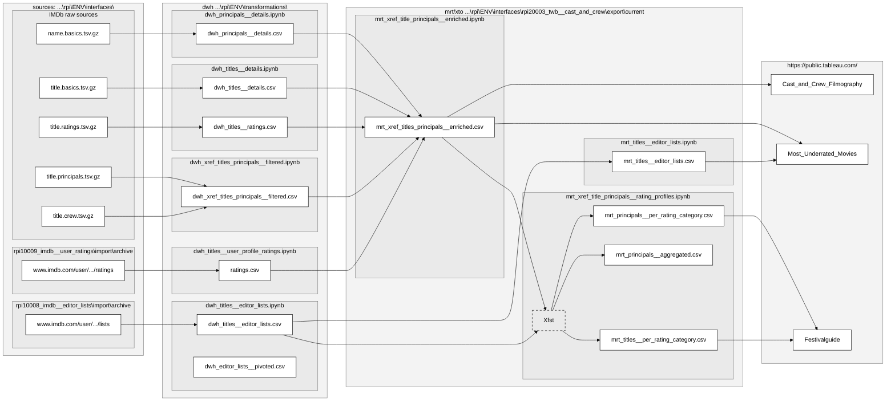

# Project Overview

## Problem Statement
Choosing a film is often difficult when the available options are unfamiliar. Whether browsing a local cinema's weekly programme, a streaming watchlist, or a film festival schedule, viewers typically have little information beyond a title, synopsis, trailer, or a single IMDb rating.

These sources provide limited insight into the people behind a film and their previous work, making it harder to judge whether a film is likely to match a viewer's interests.

## Solution
This project extends a screening programme with historical IMDb data to provide additional context for decision-making. Instead of evaluating only the films currently showing, users can explore the track record of the directors, writers, actors, producers, composers, cinematographers, editors, and other contributors behind each film.

Tableau dashboards are linked for interactive views:

### 1. Festival Guide / Screening Programme Overview
- Compare films in the selected programme using IMDb Rating and IMDb Votes. 
- Compare its contributors based on the average IMDb rating and total IMDb votes of their previous work.

with option to select film's imdb website or  Cast & Crew Filmography  
URL: https://public.tableau.com/app/profile/claudia.werner/viz/Festivalguide/FestivalBubble

### 2. Cast & Crew Filmography

 -  #### a. Individual Film: Cast & Crew Explorer
  View and compare the historical filmographies of the entire creative team behind a selected film. 
  URL: https://public.tableau.com/app/profile/claudia.werner/viz/LovedthatMovieCastCrewFilmography/CastCrew?Tconst_sel_p=tt10370710

 -  #### b. Individual Contributor: Carrer Timeline
  Explore an individual contributor's complete filmography and career progression over time.  
  URL: https://public.tableau.com/app/profile/claudia.werner/viz/LovedthatMovieCastCrewFilmography/CastCrew?Tconst_sel_p=tt10370710

### 3. Most Underrated Movies
Individual User Rating vs IMDb rating, ranked by rating discrepancy
URL: in progress

And this will produce a flow chart:

Loved that movie? Wonder whether cast & crew has teamed up before? 
See their entire filmgraphy in one glance, based on data extracted from IMDb (Python) and loaded into a dashboard (Tableau Public).

https://public.tableau.com/app/profile/claudia.werner/viz/LovedthatMovieCastCrewFilmography/CastCrew
