# Project Overview

# Screening Programme Contextualizer (cast_and_crew)

This project extends a film screening programme with historical IMDb data to provide additional context for decision-making. Instead of evaluating only the films currently showing, users can explore the comprehensive track record of the directors, writers, actors, producers, composers, cinematographers, editors, and other contributors behind each film.

## 🚀 Project Architecture

* **Source**: IMDb datasets.
* **Transformation**: Jupyter Notebook for data cleansing, filtering, and aggregation.
* **Interactive Consumption**: Tableau Public dashboard for end-user exploration.

## 🛠️ Getting Started

Data is extracted from IMDb, transformed using Python, and loaded into Tableau Public. 

All source code and data transformation pipelines can be found in the [cast_and_crew GitHub Repository](https://github.com).

## 📄 Sources, Attribution & Disclaimer

### IMDb Data
Information courtesy of IMDb ([imdb.com](http://imdb.com)). Used with permission for personal and non-commercial utilization under the [IMDb Dataset Terms and Conditions](https://imdb.com). 
* **Data Retrieval**: Sourced officially via [IMDb Interfaces](https://imdb.com).
* **Festival Curation**: Derived from data managed by [IMDb-Editors](https://imdb.com).
* *Disclaimer: This project is strictly non-commercial and intended for educational and analytical visualization purposes only.*

### Asset & Icon Attributions
* **Golmin Design**: Icons used from the [Free Daily Icon Set](https://iconfinder.com).
* **icons.design**: Assets utilized from the [Social 23 Set](https://iconfinder.com).
* **Ikonate**: Created by Mikolaj Dobrucki ([mikolajdobrucki.com](http://mikolajdobrucki.com)). Released under the [MIT License](https://opensource.org) (Copyright © Mikolaj Dobrucki).
* **Freepik**: Cinema icons sourced via [Flaticon](https://flaticon.com).

```mermaid
 flowchart LR

classDef default fill:#ffffff,stroke:#000000,color:#000000;
classDef dashed fill:none,stroke:#000000,stroke-width:1px,stroke-dasharray: 5 5;
 
%%{init: {
  "theme": "base",
  "themeVariables": {
    "clusterBkg": "#c4c0c033",
    "clusterBorder": "grey",
    "primaryColor": "#ffffff",
    "primaryBorderColor": "#000000",
    "primaryTextColor": "#000000"
  }
}}%%



subgraph "01 source ingestion"

    subgraph "☁️📥 https://datasets.imdbws.com/"
         
                A2["🎬 name.basics.tsv.gz"]
                A1["🎬 title.basics.tsv.gz"]
                A3["🎬 title.ratings.tsv.gz"]
                A4["🎬 title.principals.tsv.gz"]
                A5["🎬 title.crew.tsv.gz"]
         
    end    

    subgraph "☁️📥 https://www.imdb.com/exports/"
         
                A6["📋 www.imdb.com/user/.../lists"]:::dashed
                A7["⭐ www.imdb.com/user/.../ratings"]:::dashed

         
    end    
 end

  %%% dwh
  subgraph "02 transformation"

  %%%%

    subgraph "☁️📂 ...\rpi\ENV\interfaces\"

        subgraph "rpi10008_imdb__editor_lists\import\archive"
                  rpi10008_sg1["FILMFESTIVAL_yyyy.csv"]
        end
        
        subgraph "rpi10009_imdb__user_ratings\import\archive"
                  rpi10009_sg1["USER_PROFILE_ratings.csv"]
        end

        subgraph "interface size exceeds current gdrive storage limit"
            BD1["cln_imdb__title_basics"]:::dashed 
            BD2["cln_imdb__name_basics"]:::dashed
            BD3["cln_imdb__title_ratings"]:::dashed
            BD4["cln_imdb__title_principals"]:::dashed      
            BD5["cln_imdb__title_crew"]:::dashed          
        end    
        
    end
  %%%%
      subgraph "☁️📂 dwh ...\rpi\ENV\transformations\"
          subgraph "dwh_titles__details.ipynb"
            D1["dwh_titles__details.csv"]
            D3["dwh_titles__ratings.csv"]
          end

          subgraph "dwh_principals__details.ipynb"
            D2["dwh_principals__details.csv"]
          end

          subgraph "dwh_xref_titles_principals__filtered.ipynb"
            D4["dwh_xref_titles_principals__filtered.csv"]
          end

          subgraph "dwh_titles__user_profile_ratings.ipynb"
            rpi10009_sg3["dwh_titles__user_profile_ratings.csv"]
          end

          subgraph "dwh_titles__editor_lists.ipynb"
            D5["dwh_titles__editor_lists.csv"]
            D6["dwh_editor_lists__pivoted.csv"]
          end
      end


  %%% mart
      subgraph "☁️📂 mrt/xto   ...\rpi\ENV\interfaces\rpi20003_twb__cast_and_crew\export\current"

        subgraph "mrt_titles__editor_lists.ipynb"
                  D12["mrt_titles__editor_lists.csv"]
        end

        subgraph "mrt_xref_title_principals__01_enriched.ipynb"
                  D7["mrt_xref_titles_principals__enriched.csv"]
        end

        subgraph "mrt_xref_title_principals__02_rating_profiles.ipynb"
                D8["Xfst"]:::dashed
                D10["mrt_principals__aggregated.csv"]
                D9["mrt_titles__per_rating_category.csv"]
                D11["mrt_principals__per_rating_category.csv"]
        end
      end 

   end   

 
  %% consumption
  subgraph "03 consumption"
      subgraph "☁️👥 https://public.tableau.com/" 
        Festivalguide[" 📈 🎟️ Festivalguide"]
        Cast_and_Crew_Filmography[" 📈 🎥 Cast & Crew Filmography"]
        Most_Underrated_Movies["📈 📢 Most Underrated Movies"]       
      end
  end

  click Festivalguide "https://public.tableau.com/app/profile/claudia.werner/viz/Festivalguide/FestivalBubble" "Click to view on Tableau Public"
  click Cast_and_Crew_Filmography "https://public.tableau.com/app/profile/claudia.werner/viz/LovedthatMovieCastCrewFilmography/CastCrew?Tconst_sel_p=tt10370710" "Click to view on Tableau Public"
  
  %%% connections
 


   
 
  



  A1 --> BD1 -->  D1 --> D7
   A2 --> BD2 -->  D2 --> D7
   A3 --> BD3 -->  D3 --> D7
   A4 --> BD4 -->  D4 --> D7
  A5 --> BD5--> D4
  A6 -->rpi10008_sg1   --> D5
  A7 --> rpi10009_sg1   --> rpi10009_sg3 --> D7

  D7 --> D8
  D5 --> D8

  D8 --> D9
  D8 --> D10
  D8 --> D11

  D5 --> D12

 
  D7  --> Most_Underrated_Movies
  D12 --> Most_Underrated_Movies
  D7  --> Cast_and_Crew_Filmography
  D9  --> Festivalguide
  D11  --> Festivalguide

```

 

### 1. Festival Guide / Screening Programme Overview
- Compare films in the selected programme using IMDb Rating and IMDb Votes. 
- Compare its contributors based on the average IMDb rating and total IMDb votes of their previous work.

with option to select film's imdb website or  Cast & Crew Filmography  
URL: https://public.tableau.com/app/profile/claudia.werner/viz/Festivalguide/FestivalBubble

### 2. Cast & Crew Filmography
- Individual Film: View and compare the historical filmographies of the entire creative team behind a selected film
- Individual Contributor: xplore an individual contributor's complete filmography and career progression over time

URL: https://public.tableau.com/app/profile/claudia.werner/viz/LovedthatMovieCastCrewFilmography/CastCrew?Tconst_sel_p=tt10370710
 
### 3. Most Underrated Movies
Individual User Rating vs IMDb rating, ranked by rating discrepancy
URL: in progress
